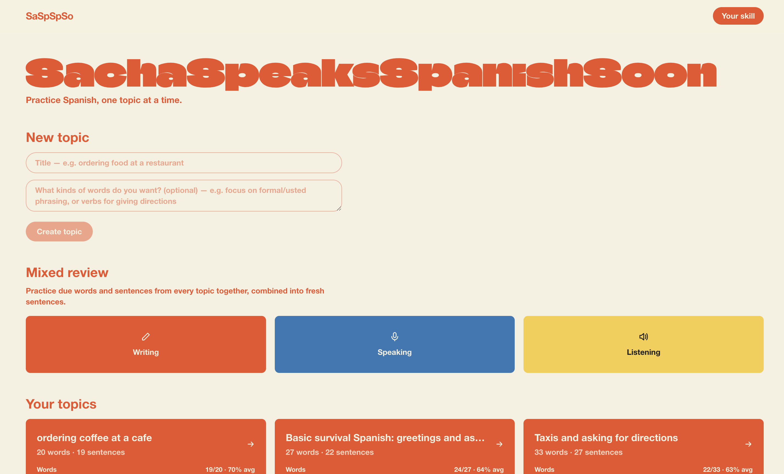
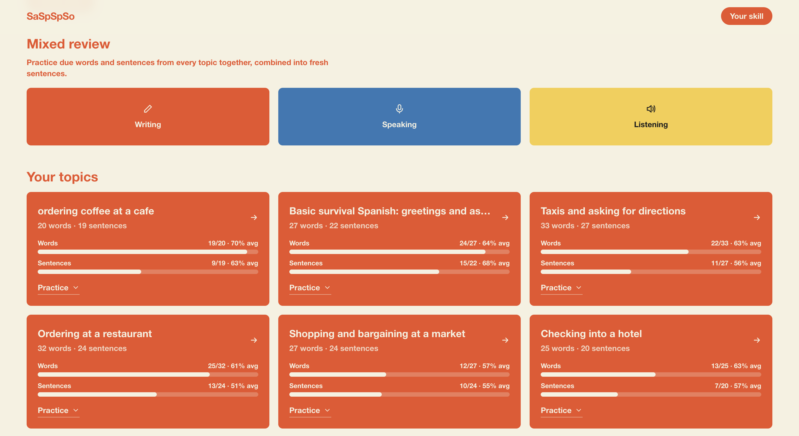
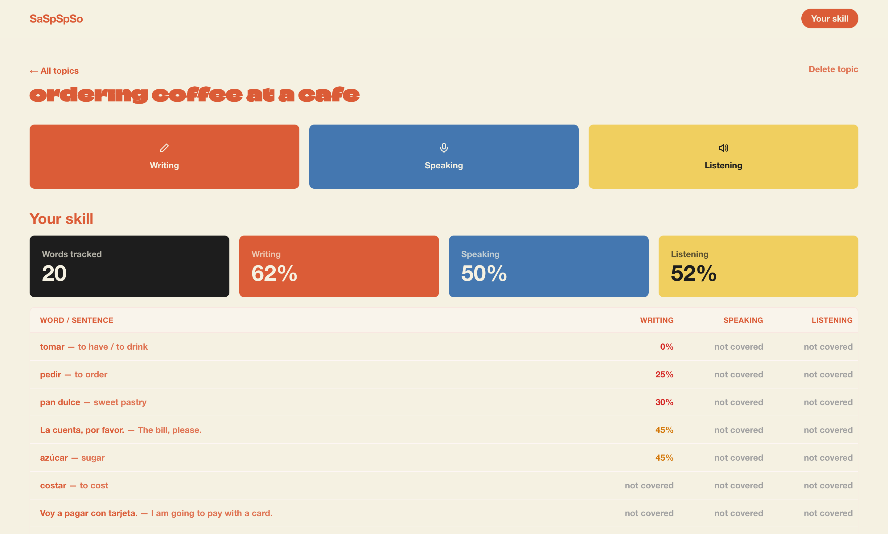

# sacha-speaks-spanish-soon

A Spanish-practice app: pick a topic, an LLM generates a word/sentence bank for it, then you practice with writing, speaking (pronunciation-checked), and listening exercises. Review scheduling is powered by [FSRS](https://github.com/open-spaced-repetition), so exercises resurface based on what you're actually about to forget, and you can ask questions mid-exercise without losing your place.

> **Status: work in progress.** This is a personal side project I'm actively building and using myself — not a finished product. See [Known limitations](#known-limitations--roadmap) below for what's still missing.

## What makes this different from flashcards

The core idea: **you should never be able to memorize the sentence instead of learning the word.** Most vocab apps quiz you on a fixed bank of pre-written sentences, so after enough repetitions you're pattern-matching the sentence, not recalling the word. Here, every practice attempt asks Gemini to generate a brand-new sentence on the spot — it must use the specific word being tested plus 1-3 other words you already know, combined into something a native speaker would actually say, and it's steered away from repeating recent sentences for that word. So the same word keeps showing up in different, realistic contexts instead of the same memorized line.

That's paired with per-word spaced repetition (FSRS) rather than per-topic or per-deck scheduling, so what surfaces for review is driven by what you're actually about to forget, across every topic at once.

It also treats writing, speaking, and listening as three equally-weighted, on-demand modes rather than one dominant mode with the others sprinkled in occasionally. Most apps default hard to reading/writing and surface a listening exercise every so often as a change of pace; here you can drill listening (or speaking) as much as you want, whenever you want, on the same underlying vocabulary.

Feedback is per-word, not one verdict for the whole answer. Each word in your translation gets its own correct/acceptable/wrong/missing verdict, highlighted inline in the sentence, with a note explaining *why*: a genuinely wrong word gets told apart from a spelling slip that a native speaker would still understand, and a wrong word gets diagnosed rather than just flagged — it checks whether you likely meant a different real Spanish word (and whether that word would even work here), or mixed it up with a French/Italian lookalike, before giving the right answer. Speaking gets the same treatment aimed at pronunciation instead of word choice.

## Features

- **Novel-sentence generation, not fixed decks** — see above; sentences are generated fresh per attempt from your known-vocabulary whitelist, not pulled from a static bank.
- **Topic-driven generation** — describe a topic (e.g. "ordering coffee", "at the doctor") and an LLM builds a vocabulary bank for it.
- **Global vocabulary** — words are shared across topics instead of duplicated, so recall tracking stays consistent no matter where a word was first learned.
- **Three exercise types** — writing (typed translation, graded per-word), speaking (recorded via the mic, checked for pronunciation), and listening (a sentence is spoken via TTS, you type the English translation, graded the same way as writing).
- **Mixed review mode** — practice across all topics at once, focused on your weakest or most stale items rather than one topic in isolation.
- **Spaced repetition (FSRS)** — every attempt updates a per-word retrievability estimate; the "skill overview" page shows live recall estimates per word, per topic, and overall, decaying continuously between reviews.
- **Per-topic progress at a glance** — the topics grid shows words/sentences tracked and % mastery per mode for each topic, so you can see where to focus before diving in.
- **Delete a topic** — remove one you don't need anymore (cascades its words/sentences/attempts).
- **In-exercise Q&A** — ask a grammar/vocab question mid-exercise without losing your place in the review queue.
- **Locked to Mexican Spanish** — generation and grading are pinned to one dialect/register for consistency.

## Stack

- [Next.js](https://nextjs.org) (App Router, TypeScript)
- [Drizzle ORM](https://orm.drizzle.team) over Postgres ([Neon](https://neon.tech))
- [Gemini API](https://ai.google.dev) (`@google/genai`) for the agents that need real audio understanding (pronunciation grading, spoken Q&A), plus translation grading and sentence generation
- [Mistral API](https://mistral.ai) for the remaining text-only agents (bank building, text Q&A), split off so those high-frequency calls don't compete with Gemini's quota — also serves as the automatic fallback for translation grading if Gemini's call fails or its free-tier quota is exhausted
- [ts-fsrs](https://github.com/open-spaced-repetition/ts-fsrs) for spaced-repetition scheduling
- Browser `SpeechSynthesis` / `MediaRecorder` for text-to-speech and mic capture — no server-side audio processing

## Local development

1. Copy `.env.example` to `.env.local` and fill in `GEMINI_API_KEY` ([get one here](https://aistudio.google.com/apikey)), `MISTRAL_API_KEY` ([get one here](https://console.mistral.ai)), and `DATABASE_URL` (a Postgres connection string — [Neon](https://neon.tech) works well for this).
2. `npm install`
3. `npm run db:push` — push the Drizzle schema to your database.
4. `npm run dev` — starts the app at [http://localhost:3000](http://localhost:3000).

There's no seed data — the first thing to do after setup is create a topic from the home page, which triggers bank generation for it.

## Known limitations / roadmap

This is mid-build, not finished. Notably:

- **No authentication.** Everything is single-user by design right now; there's no login or per-user data separation.
- **No way to delete individual words yet.** Whole topics can be deleted (cascading their words/sentences/attempts), but there's no per-word deletion.
- **Model/task assignment is still being balanced.** Gemini and Mistral are now split by task (audio-understanding + translation grading + sentence generation on Gemini, bank-building/tutor text on Mistral, with Mistral as an automatic fallback for grading), but that split — and the choice of model/settings within each provider — is still being tuned rather than settled.
- **Repeat-avoidance is a soft prompt hint, not a hard guarantee.** The sentence generator is told which recent sentences to avoid, but nothing enforces novelty deterministically — could still use more deterministic scaffolding around the LLM calls generally.
- **Prompts are still being tuned.** Generation/grading quality varies by topic and needs more iteration.
- **No automated tests.**
- **No rate limiting or cost guards** around the Gemini/Mistral calls — fine for personal use, not safe to expose publicly as-is.
- Mobile layout and cross-browser mic/speech-API support haven't been hardened.

Because of the lack of authentication — anyone hitting a public instance could create, practice, or delete topics — this repo doesn't link a public live demo. It's meant to be run locally by anyone reviewing the code.

## License

MIT — see [LICENSE](LICENSE).
